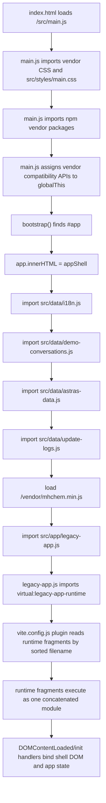

# AstraChat Vite Refactor Plan

> Phase 1 scope: analysis and planning only. No runtime, CSS, template, or test code was changed.

## 0. Baseline And Inputs

This plan is based on the current `astrachat-vite` project at version `16.4.5`, plus the requested Agent Skills principles from `addyosmani/agent-skills`:

- `code-simplification`: preserve exact behavior, understand before touching, reduce complexity in reviewable slices, avoid line-count-only refactors.
- `deprecation-and-migration`: migrate legacy systems incrementally with adapters and replacements before removal.
- `frontend-ui-engineering`: preserve UI behavior, accessibility, responsive layout, existing selectors, and design-system intent.

Local baseline verified:

- `node --test tests/ui-regressions.test.js`: pass, 13 tests.
- `npm run check:sizes`: PowerShell blocks `npm.ps1` on this machine, but `npm.cmd run check:sizes` runs and fails for the expected size baseline.
- `npm.cmd run check:sizes` current failure:
  - `src/styles/main.css`: 188.3 KB, over 150 KB.
  - `src/app/legacy-runtime/fragments/02-runtime.fragment.js`: 154.3 KB, over 150 KB.

The repo currently has no `npm test` script. Add one later, but not in Phase 1.

## 1. Existing Architecture Mental Model

AstraChat is a vanilla JavaScript Vite app with a shell-first bootstrap and a legacy runtime assembled at build time.

The app has four main layers:

1. `index.html` provides the root document, `#app`, app metadata, and loads `/src/main.js`.
2. `src/main.js` imports CSS and npm vendor packages, exposes vendor compatibility globals on `globalThis`, writes the shell HTML into `#app`, then loads data modules and legacy runtime.
3. `src/templates/app-shell.js` concatenates `src/templates/fragments/*.fragment.js` into one large HTML string. The fragment files are small by line count, but each one contains dense escaped HTML.
4. `src/app/legacy-app.js` imports `virtual:legacy-app-runtime`. The Vite plugin in `vite.config.js` reads `src/app/legacy-runtime/fragments/*.fragment.js`, sorts by filename, concatenates their source, and returns one virtual module.

The legacy runtime is not modular yet in the normal ES module sense. Later fragments rely on variables, functions, state, DOM references, and constants defined by earlier fragments. The current numeric prefixes are therefore part of the runtime contract.

Global data and vendor dependencies are implicit:

- Vendor globals from `src/main.js`: `marked`, `DOMPurify`, `Chart`, `JSZip`, `Cropper`, `katex`, `Peer`, `QRCode`, `Html5Qrcode`.
- Data globals from data modules: `i18n`, `demoConversations`, `OFFICIAL_ASTRAS`, `updateLogs`.
- Late runtime global: `__astraShowUpdateDialog`.

## 2. Startup Flow



Important sequencing notes:

- `appShell` must be mounted before runtime code queries DOM IDs.
- Data modules must run before `00-runtime.fragment.js` destructures `globalThis.i18n`, `globalThis.demoConversations`, `globalThis.OFFICIAL_ASTRAS`, and `globalThis.updateLogs`.
- `/vendor/mhchem.min.js` must load before formula rendering paths expect mhchem side effects.
- Runtime fragment order is currently implementation-critical and not validated by tests except indirectly.

## 3. Runtime Fragment Responsibility Guesses

These are responsibility guesses from function names, DOM IDs, constants, and coupling points. Treat them as hypotheses until protected by tests.

| Fragment | Current size | Likely responsibility | Migration notes |
| --- | ---: | --- | --- |
| `00-runtime.fragment.js` | 104.2 KB | Foundation layer. Reads globals, initializes demo login shell behavior, builds `ALL_ELEMENTS`, declares model catalog, model capability helpers, council config helpers, colors, persistent config/app data helpers, IndexedDB helpers, crypto/password helpers, markdown/formula rendering helpers, notifications, modal helpers, default config/folder setup, and core submission helper. | Highest order dependency. Do not split first unless extracting pure data/constants with an adapter export surface. This file defines many symbols consumed later. |
| `01-runtime.fragment.js` | 145.7 KB | Primary UI render layer. Renders folders/history/chat, archived chats, Astras, model switcher, council popover and progress UI, input indicators, media preview/lightbox, message bubbles, typewriter/streaming markdown, and high-level `submitChatForm` response playback paths. | Near size limit. Good candidate for later feature-sliced extraction once render tests exist. Keep DOM IDs/classes exactly stable. |
| `02-runtime.fragment.js` | 154.3 KB | API, model council, settings, theme, auth, and folder mutation layer. Handles Gemini/OpenRouter/NVIDIA/Step Plan/Tavily calls, web search decisions, council execution/synthesis, schema calls, title generation, submit/input state, translator/output-mode settings controls, mobile settings shell, save settings, theme and color menus, login/logout/delete all data, create folder. | Immediate size-check blocker. Split only along low-risk boundaries first, for example settings mobile UI helpers or Step Plan/Tavily helpers, while preserving execution order through an adapter. |
| `03-runtime.fragment.js` | 80.6 KB | Data and utility workflows. Batch actions, search modal/results, file upload/preview/import/export, auth import, model management UI, voice input, memory extraction/refinement, API warning badge, dashboard and charts. | Medium risk because it touches storage, file APIs, browser permissions, and generated HTML. Good later target after tests for import/export and file preview. |
| `04-runtime.fragment.js` | 66.7 KB | Visual personalization and secondary views. Time analysis charts, wallpaper brightness/cropping, UI theme application, store rendering/subscription, avatar crop, language application, mobile context menus, scroll-to-bottom behavior, update modals, trash rendering and permanent delete/restore. | Can be split by independent feature groups after chart/wallpaper/trash tests exist. Uses `Chart` and `Cropper` vendor globals indirectly. |
| `05-runtime.fragment.js` | 48.5 KB | App initialization and event binding plus P2P sender/receiver implementation. Sends feedback/proposals via Google Apps Script, compresses images, initializes chat app listeners, attachment mobile menu, P2P code generation and WebRTC chunk transfer. | Event binding order is risky. Extract `init` only after documenting listener ownership. P2P should get a dedicated adapter before moving. |
| `06-runtime.fragment.js` | 17.1 KB | Tail-end fixes and late bindings. P2P progress/QR scanner, delete message pair, auth import toggles, final login/demo bootstrap, textarea height and desktop multiline layout, login language menu, exposes `__astraShowUpdateDialog`. | Small but order-sensitive. Likely contains patches that depend on all prior definitions. Do not treat as low risk just because it is small. |

## 4. Shell Template Fragment Responsibility Guesses

The shell fragments have very low line counts because each file is one long escaped string. Complexity should be measured by IDs, sections, and behavioral coupling, not line count.

| Fragment | Current size | Main IDs and likely responsibility |
| --- | ---: | --- |
| `00-shell.fragment.js` | 12.8 KB | Login/marketing shell, demo chat area, app container start, sidebar start, Astras sidebar controls. Key IDs include `auth-container`, `login-lang-btn`, `auth-form`, `demo-chat-window`, `app-container`, `sidebar`, `open-search-btn`, `new-chat-btn`, `open-store-btn`, `share-astras-btn`. |
| `01-shell.fragment.js` | 11.8 KB | Sidebar lists, batch action bar, top controls, main chat layout start, history sidebar, input container start, file popover start. Key IDs include `astras-list`, `folder-list`, `history-list`, `batch-action-bar`, `user-controls`, `model-switcher-container`, `message-list`, `input-bar-container`, `file-options-popover`, `camera-btn`. |
| `02-shell.fragment.js` | 12.1 KB | File option buttons, chat form, submit controls, Astras store, settings modal start, personalization section. Key IDs include `upload-image-btn`, `web-search-popover-btn`, `learning-mode-btn`, `chat-form`, `message-input`, `store-container`, `settings-modal`, `personalization-section`, `theme-light-btn`, `ui-language-select`. |
| `03-shell.fragment.js` | 11.7 KB | Personalization continuation, memory settings, model settings, data settings, accessibility controls. Key IDs include `color-theme-custom`, `custom-color-swatches`, `ai-bubble-color-dropdown`, `memory-section`, `personal-memory-list`, `model-management-section`, `gemini-api-key-input`, `export-data-btn`, `accessibility-section`. |
| `04-shell.fragment.js` | 11.7 KB | Trash/about settings and export/import modals. Key IDs include `trash-section`, `trash-batch-select-btn`, `trash-list-container`, `about-section`, `send-feedback-btn`, `update-info-btn`, `export-data-modal`, `import-data-modal`, `import-data-modal-auth`. |
| `05-shell.fragment.js` | 12.9 KB | Auth import continuation, archived/view/rename/folder settings/search/trash view/custom dialog/Astras create modals. Key IDs include `archived-chats-modal`, `view-archived-chat-modal`, `rename-modal`, `folder-settings-modal`, `search-modal`, `search-view-modal`, `trash-view-modal`, `notification-container`, `custom-dialog-modal`, `astras-create-modal`. |
| `06-shell.fragment.js` | 13.0 KB | Astras create continuation, batch move, dashboard, crop/avatar/update/proposal/P2P modal start, hidden file inputs. Key IDs include `batch-move-modal`, `data-dashboard-modal`, `model-usage-pie-chart`, `wallpaper-crop-modal`, `astras-avatar-modal`, `update-info-modal`, `latest-update-modal`, `image-video-input`, `astras-proposal-modal`, `p2p-share-modal`. |
| `07-shell.fragment.js` | 4.8 KB | P2P modal steps and dynamic menu wrappers. Key IDs include `p2p-role-sender`, `p2p-step-select`, `p2p-qrcode-container`, `p2p-step-connect`, `p2p-reader`, `p2p-step-progress`, `mobile-context-menu-wrapper`, `attachment-menu-wrapper`. |

## 5. Current High-Risk Areas

- Runtime fragment concatenation depends on filename sort order. Any extracted module that changes declaration timing can break later fragments.
- `globalThis` vendor globals are hidden dependencies. Removing or renaming them before a bridge exists would break runtime code.
- `src/main.js` is both bootstrapper and vendor bridge. Changing it can break every path.
- `ALL_ELEMENTS` in `00-runtime.fragment.js` binds hundreds of shell IDs. Template splitting must preserve every ID and class.
- CSS selectors are tightly coupled to runtime-generated classes like `visible`, `active`, `has-indicators`, `has-multiline-input`, `settings-mobile-detail-open`, `is-active`, and `btn-outline-white`.
- `src/styles/main.css` has multiple correction layers, repeated `:root` and `.dark` blocks, many `!important` rules, and 21 media blocks. Moving rules without cascade tests can silently alter UI.
- Template fragments contain large HTML strings with escaped quotes. Line count hides complexity and makes partial edits hard to review.
- Tests currently assert many exact regex patterns in CSS/runtime. They protect known regressions but can also fail when safe moves change text layout.
- `02-runtime.fragment.js` is size-blocking and contains API calls, settings UI, auth, and folder mutation in one file, so a naive split has broad blast radius.
- Data files are global side-effect modules. Converting them to pure exports before the runtime bridge exists would break startup.
- `05-runtime.fragment.js` and `06-runtime.fragment.js` are event-binding and patch-heavy. Small size does not mean low risk.

## 6. Currently Safer Refactor Areas

Safer means smaller blast radius if guarded by existing tests plus a few new structural tests.

- Add tests that verify runtime fragment ordering and shell ID presence before moving code.
- Introduce a `src/app/vendor-bridge.js` wrapper that centralizes the current `globalThis` assignments while keeping exact global names. This should be done before removing assignments from `main.js`.
- Introduce a `src/app/data-bridge.js` or documented data loader plan that preserves `globalThis` side effects while allowing data files to later become pure exports.
- Split CSS by importing additional CSS files from `main.css`, preserving selector text and import order. This can reduce physical file size without changing the cascade if done carefully.
- Move standalone pure data/constants from runtime into modules only if the legacy virtual module still receives the same symbols in the same order.
- Extract `02-runtime.fragment.js` helper groups that do not need hoisting side effects first, for example Step Plan MIME helpers or mobile settings helper constants, but keep a wrapper in the concatenated runtime until tests are expanded.
- Rename or annotate template fragment responsibilities without changing HTML. A safer first step is adding README documentation and shell ID tests, not rewriting HTML.

## 7. Suggested New Directory Structure

This is a target structure, not a Phase 1 change.

```text
src/
  app/
    bootstrap/
      mount-shell.js
      load-data.js
      vendor-bridge.js
    legacy-app.js
    legacy-runtime/
      README.md
      fragments/
      adapters/
        legacy-globals.js
        legacy-dom.js
        legacy-storage.js
      features/
        models/
          model-catalog.js
          model-capabilities.js
        council/
          council-config.js
          council-api.js
          council-rendering.js
        settings/
          settings-mobile.js
          settings-save.js
          theme-controls.js
        chat/
          render-chat.js
          streaming-renderer.js
          input-state.js
        files/
          upload-preview.js
          import-export.js
        personalization/
          wallpaper.js
          colors.js
        p2p/
          p2p-state.js
          p2p-transfer.js
          p2p-ui.js
  data/
    i18n/
      index.js
      zh-TW.js
      en.js
      fr.js
    astras/
      official-astras.js
    update-logs/
      index.js
      entries.js
  styles/
    main.css
    base.css
    sidebar.css
    chat.css
    input.css
    settings.css
    model-council.css
    modals.css
    store.css
    personalization.css
    p2p.css
    regression-overrides.css
  templates/
    app-shell.js
    fragments/
    README.md
```

## 8. Phased Refactor Plan

### Phase 0: Safety Net And Inventory

Goal: make current implicit contracts visible before moving behavior.

Files to change:

- `tests/ui-regressions.test.js`
- Possibly add `tests/structure-regressions.test.js`
- Possibly add `npm test` script in `package.json`

Work:

- Add a test that verifies every runtime fragment is sorted by numeric prefix and contains expected sentinel symbols.
- Add a test that imports `appShell` and verifies critical IDs exist exactly once where appropriate.
- Add a test that confirms `src/main.js` still assigns expected vendor globals, or later confirms `vendor-bridge.js` does.
- Add `npm test` as `node --test tests/*.test.js`.

Verification:

- `node --test tests/ui-regressions.test.js`
- `node --test tests/*.test.js`
- `npm.cmd run check:sizes` remains allowed to fail until CSS and `02-runtime.fragment.js` are reduced.

### Phase 1: Bootstrap And Vendor Bridge

Goal: isolate the bootstrap responsibilities without changing runtime globals.

Files to change:

- `src/main.js`
- Create `src/app/bootstrap/vendor-bridge.js`
- Create `src/app/bootstrap/load-vendor-script.js`
- Create `src/app/bootstrap/mount-shell.js`
- Optional `tests/structure-regressions.test.js`

Work:

- Move current vendor `globalThis` assignments into `installVendorBridge()`.
- Move QRCode compatibility class with the vendor bridge.
- Move `loadVendorScript()` into a tiny utility.
- Keep `main.js` as the same sequence: import CSS, import vendors, install bridge, mount shell, import data, load mhchem, import legacy app.

Verification:

- `node --test tests/*.test.js`
- `npm.cmd run build`
- Manual smoke: app boots, login screen renders, console has no bootstrap errors.

### Phase 2: CSS Physical Split Without Selector Changes

Goal: make `src/styles/main.css` pass the 150 KB file-size limit while preserving cascade order.

Files to change:

- `src/styles/main.css`
- Create focused CSS files under `src/styles/`
- `tests/ui-regressions.test.js` if regex reads must include imported CSS files.
- Possibly `scripts/check-file-sizes.mjs` only if it should report CSS imports clearly, not to weaken the limit.

Work:

- Keep `main.css` as an ordered import manifest.
- Move contiguous CSS blocks into files by feature, preserving order:
  - `base.css`
  - `sidebar.css`
  - `chat.css`
  - `input.css`
  - `settings.css`
  - `model-council.css`
  - `modals.css`
  - `store.css`
  - `personalization.css`
  - `p2p.css`
  - `regression-overrides.css`
- Do not rename selectors or class names.
- Keep late correction layers late, likely in `regression-overrides.css`.

Verification:

- Update tests to read the composed CSS content or assert in the new target files.
- `node --test tests/*.test.js`
- `npm.cmd run check:sizes`: `main.css` should pass, but `02-runtime.fragment.js` may still fail.
- `npm.cmd run build`
- Browser visual smoke at desktop and mobile widths.

### Phase 3: Data Modules Structure Without Content Rewrites

Goal: reduce future data-file pressure while preserving global side effects.

Files to change:

- `src/data/i18n.js`
- Create `src/data/i18n/index.js`, `zh-TW.js`, `en.js`, `fr.js` or equivalent.
- `src/data/update-logs.js`
- Create `src/data/update-logs/index.js`, `entries.js`.
- Possibly `src/data/astras-data.js` later, but not first.

Work:

- Split i18n by locale, preserving exact object contents.
- Keep `src/data/i18n.js` as compatibility entry that imports locale objects, assigns `window.i18n` and `globalThis.i18n`, and exports the same default.
- Split update logs into entries, preserving exact order and content.
- Do not edit translated strings or update log HTML.

Verification:

- `node --test tests/*.test.js`
- Add data shape tests: locale keys load, `globalThis.i18n` exists after import, latest `updateLogs[0].version` is `16.4.5`.
- `npm.cmd run build`

### Phase 4: Reduce `02-runtime.fragment.js` With Adapters

Goal: make `02-runtime.fragment.js` pass the file-size limit without changing behavior.

Files to change:

- `src/app/legacy-runtime/fragments/02-runtime.fragment.js`
- Create modules under `src/app/legacy-runtime/features/` or `src/app/legacy-runtime/adapters/`
- `vite.config.js` only if the virtual runtime needs to include feature modules in a controlled way.
- Tests for settings, API helper shape, and fragment order.

Work:

- First extract low-coupling helpers:
  - Step Plan MIME and attachment formatting helpers.
  - Tavily query formatting helpers.
  - Settings mobile shell constants and icon map.
- Use adapter functions attached to a stable namespace only if needed, for example `legacyRuntimeHelpers.settingsMobile`.
- Keep existing fragment execution order. Do not convert the entire runtime to imports in one step.
- Keep `02-runtime.fragment.js` as the orchestrator until helpers are proven stable.

Verification:

- `node --test tests/*.test.js`
- `npm.cmd run check:sizes`: should pass after `02-runtime.fragment.js` drops below 150 KB and CSS is already split.
- `npm.cmd run build`
- Manual smoke: mobile settings open/list/detail/back behavior, web search input state, model council flow start, save settings.

### Phase 5: Feature-Slice Runtime Migration

Goal: gradually turn legacy fragments into feature modules.

Files to change:

- `src/app/legacy-runtime/fragments/00-runtime.fragment.js`
- `src/app/legacy-runtime/fragments/01-runtime.fragment.js`
- `src/app/legacy-runtime/fragments/03-runtime.fragment.js`
- `src/app/legacy-runtime/fragments/04-runtime.fragment.js`
- `src/app/legacy-runtime/fragments/05-runtime.fragment.js`
- `src/app/legacy-runtime/fragments/06-runtime.fragment.js`
- Feature modules under `src/app/legacy-runtime/features/`

Work:

- Move pure model catalog and capability helpers after tests protect visible model behavior.
- Move streaming markdown renderer after tests protect streamed text, tables, media, and council details.
- Move import/export and file preview after tests protect ZIP/JSON import/export and preview DOM.
- Move P2P only after QR and Peer adapter tests exist.

Verification:

- `node --test tests/*.test.js`
- `npm.cmd run build`
- Manual smoke for each feature slice before the next slice.

## 9. Phase File Matrix

| Phase | Files modified |
| --- | --- |
| 0 | `tests/ui-regressions.test.js`, maybe `tests/structure-regressions.test.js`, maybe `package.json` |
| 1 | `src/main.js`, new `src/app/bootstrap/*.js`, tests |
| 2 | `src/styles/main.css`, new `src/styles/*.css`, tests reading CSS |
| 3 | `src/data/i18n.js`, new `src/data/i18n/*.js`, `src/data/update-logs.js`, new `src/data/update-logs/*.js`, tests |
| 4 | `src/app/legacy-runtime/fragments/02-runtime.fragment.js`, new helper modules, maybe `vite.config.js`, tests |
| 5 | Runtime fragments and new feature modules, one feature slice at a time |

## 10. Verification Strategy By Phase

Minimum verification after every phase:

```bash
node --test tests/ui-regressions.test.js
npm.cmd run build
```

Once `npm test` is added:

```bash
npm.cmd test
npm.cmd run build
```

Size verification:

```bash
npm.cmd run check:sizes
```

Browser/UI verification should include:

- Desktop layout at 1024px and 1440px.
- Mobile layout at 320px and 768px.
- Login screen, app shell, settings modal, mobile settings drill-in/back, chat input with active indicators, model council popover, file attachment menu, store, trash, import/export modal, update modal.
- Console should be checked for bootstrap/runtime errors.

## 11. Areas To Avoid For Now

- Do not rewrite the whole app or introduce React, Vue, Svelte, Redux, Next.js, or a large framework.
- Do not remove `globalThis` vendor names until all runtime consumers use a bridge.
- Do not change shell IDs, class names, or `data-lang-key` attributes during structural work.
- Do not reorder runtime fragments casually. The numeric filename order is a contract.
- Do not edit i18n strings or update-log content during structural migration.
- Do not optimize CSS by merging or renaming selectors before visual tests are stronger.
- Do not move P2P internals first. They depend on Peer, QRCode, Html5Qrcode, modal shell IDs, and late event binding.
- Do not remove apparently duplicated CSS correction layers until visual regression coverage proves they are redundant.
- Do not replace IndexedDB/local persistence helpers before data import/export tests exist.

## 12. Quick Wins

- Add `npm test` as `node --test tests/*.test.js`.
- Add shell ID coverage by importing `src/templates/app-shell.js` and checking critical IDs.
- Add runtime fragment order coverage by reading `src/app/legacy-runtime/fragments`.
- Add a small `vendor-bridge.js` without changing public globals.
- Add a `src/templates/fragments/README.md` mapping shell fragment responsibilities.
- Add a `src/styles/README.md` or top comment defining CSS split order before splitting.
- Use `npm.cmd` in Windows documentation to avoid PowerShell execution-policy friction.
- Add a test helper that reads concatenated CSS imports so CSS split does not weaken existing regex assertions.

## 13. Open Questions

- Are the mojibake-looking strings in terminal output only a console encoding issue, or are some source files encoded inconsistently?
- Which CSS correction layers are intentional current behavior versus historical patches?
- Does production require `mhchem.min.js` before all KaTeX rendering, or only before specific formula types?
- Which runtime functions are used by inline HTML attributes, if any?
- Are Google Apps Script feedback/proposal endpoints production-owned and still active?
- Should `updateLogs` future dates be treated as planned release metadata or test/demo data?
- What manual smoke checklist does the project owner consider release-critical?
- Should file-size limits apply to generated/static data files long term, or only source/runtime/CSS files?
- Should the legacy virtual module eventually support explicit imports, or should it remain a compatibility wrapper while feature modules are imported by a new entry?

## 14. Route To Make `npm run check:sizes` Pass

Current blockers:

- `src/styles/main.css`: 188.3 KB.
- `src/app/legacy-runtime/fragments/02-runtime.fragment.js`: 154.3 KB.

Route:

1. Split `main.css` into ordered imported CSS files while preserving every selector and cascade order. This should bring `main.css` far under 150 KB, and each feature CSS file should stay below 150 KB.
2. Reduce `02-runtime.fragment.js` by extracting a first helper group of at least 8 KB. Preferred first extraction targets:
   - Step Plan MIME/attachment helpers.
   - Tavily query formatting helpers.
   - Settings mobile constants/icon map and shell helper scaffolding.
3. Keep extracted helpers behavior-compatible through an adapter namespace or controlled import path.
4. Add tests before and after the extraction so passing size check is not the only proof.
5. Run:

```bash
node --test tests/*.test.js
npm.cmd run check:sizes
npm.cmd run build
```

Success condition:

- Every file under `src/` is below 150 KB.
- Existing UI regression tests still pass.
- Build succeeds.
- Manual smoke confirms no visible layout regressions.

## 15. First Recommended Low-Risk Phase

Start with Phase 0: Safety Net And Inventory.

Reason:

- It changes no production behavior.
- It makes hidden contracts explicit: fragment order, shell IDs, vendor globals, and CSS regression expectations.
- It reduces risk before touching `main.js`, CSS, or `02-runtime.fragment.js`.
- It prepares the test harness for Phase 2 CSS splitting, where existing tests must be taught to read the composed CSS instead of only `main.css`.

Concrete first slice:

1. Add `tests/structure-regressions.test.js`.
2. Assert runtime fragment filenames sort to `00` through `06`.
3. Import `src/templates/app-shell.js` and assert critical IDs exist.
4. Assert `package.json` still lacks or later includes an intentional `test` script.
5. Run `node --test tests/*.test.js`.

